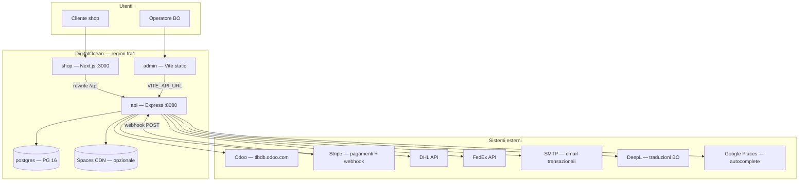

# Mappa go-live — Idea di Luce su DigitalOcean

Documento di riferimento per la **messa online** del monorepo e di tutti i **sistemi annessi** (ERP, pagamenti, spedizioni, email, media).

| File correlato | Ruolo |
|----------------|-------|
| [`platform-map.yaml`](platform-map.yaml) | **Solo mappa collegamenti** (no deploy, no env, no secret) |
| [`app.yaml`](app.yaml) | Spec App Platform **produzione** |
| [`app.staging.yaml`](app.staging.yaml) | Spec **staging** (branch `staging`) |
| [`secrets.production.env.example`](secrets.production.env.example) | Secret da incollare in UI |
| [`../docs/deploy-digitalocean.md`](../docs/deploy-digitalocean.md) | Guida operativa passo-passo |

---

## 1. Panorama architettura



### Componenti su App Platform

| Nome DO | Tipo | Stack | Porta / output | Health |
|---------|------|-------|----------------|--------|
| `api` | Web Service | Express, Prisma, Product Hub, job in-process | 8080 | `GET /health` |
| `shop` | Web Service | Next.js (`client/`) | 3000 | `GET /` |
| `admin` | Static Site | Vite SPA (`admin/dist`) | — | build artifact |
| `postgres` | Managed DB | PostgreSQL 16 | 5432 | managed |

**Schema DB:** `public` (BFF: utenti, carrelli, ordini PWA, CMS, shipping, tax) + `hub` (catalogo import Woo / arricchimenti).

**Job in-process (solo `api`, nessun worker separato):**

| Scheduler | Scopo |
|-----------|--------|
| `odooSyncRetry` | Retry sync ordini verso Odoo |
| `paidSyncAlert` | Alert email ordini `PAID_SYNC_PENDING` |
| `abandonedCart` | Elaborazione carrelli abbandonati |
| `syncRetryWorker` | Retry generici coda sync |

---

## 2. URL pubblici (placeholder DigitalOcean)

Nessun dominio custom nello spec: DigitalOcean assegna automaticamente URL `*.ondigitalocean.app` per componente.

| Componente DO | Variabile nello spec | Esempio URL |
|---------------|----------------------|-------------|
| `shop` | `${shop.PUBLIC_URL}` | `https://shop-xxxxx.ondigitalocean.app` |
| `api` | `${api.PUBLIC_URL}` | `https://api-xxxxx.ondigitalocean.app` |
| `admin` | `${admin.PUBLIC_URL}` | `https://admin-xxxxx.ondigitalocean.app` |

Lo spec collega già le origini tra loro:

- `CLIENT_ORIGIN`, `CHECKOUT_REDIRECT_BASE`, `APP_PUBLIC_URL`, `PUBLIC_SITE_URL` → `${shop.PUBLIC_URL}`
- `ADMIN_ORIGIN` → `${admin.PUBLIC_URL}`
- `API_URL`, `NEXT_PUBLIC_API_URL`, `VITE_API_URL` → `${api.PUBLIC_URL}`
- `NEXT_PUBLIC_SITE_URL` → `${shop.PUBLIC_URL}`

**Non serve alcun aggiornamento manuale** degli URL finché si usano i placeholder DO.

**CORS / cookie:** Express ha `trust proxy`; sessioni shop (`sid`) e admin (`admin_sid`) usano le origini sopra.

> In futuro, per domini custom (`www.ideadiluce.it`, ecc.): mapparli dalla UI DO e aggiornare le stesse variabili con gli URL definitivi (+ rebuild `shop` per `NEXT_PUBLIC_SITE_URL`).

---

## 3. Sistemi annessi

### 3.1 Odoo (`tlbdb.odoo.com`)

| Integrazione | Protocollo | Env principali | Go-live |
|--------------|------------|----------------|---------|
| Catalogo storefront (catalogo Odoo) | REST `/api/v2/products` | `ODOO_CATALOG_*` | Obbligatorio |
| Ordini, stock, partner, preventivi | XML-RPC | `ODOO_*` | Obbligatorio |
| Link prodotto nel BO admin | URL UI | `ODOO_URL`, `ODOO_PRODUCT_ACTION_ID` | Consigliato |
| Listini B2C / B2B / Professional | XML-RPC | `ODOO_PRICELIST_*_ID` | Se segmentazione prezzi attiva |

**Non deployato su DO:** l’istanza Odoo resta esterna; solo variabili verso `https://tlbdb.odoo.com`.

### 3.2 Stripe

| Elemento | Dove configurare |
|----------|------------------|
| Chiavi live | Secret su `api` + `NEXT_PUBLIC_STRIPE_PUBLISHABLE_KEY` su `shop` (BUILD) |
| Webhook | `https://<api-….ondigitalocean.app>/api/v1/payments/webhook/stripe` |
| Evento minimo | `checkout.session.completed` |
| Apple Pay | Stripe Dashboard → dominio shop (URL `shop` da DO) |

Verifica locale: `npm run stripe:setup`, `npm run stripe:webhook`.

### 3.3 Spedizioni (DHL / FedEx)

| Elemento | Env | Note |
|----------|-----|------|
| Credenziali corrieri | `DHL_*`, `FEDEX_*` | Configurate dal BO admin (cifrate con `SHIPPING_CREDENTIALS_KEY`) |
| Cifratura DB | `SHIPPING_CREDENTIALS_KEY` | **32+ caratteri**, obbligatoria in produzione |
| Ritiro in negozio | `STORE_PICKUP_*` | Indirizzo sede unica (Roma) |

### 3.4 Email (SMTP)

| Uso | Env |
|-----|-----|
| Reset password, alert sync Odoo, notifiche BO | `SMTP_*`, `PAID_SYNC_ALERT_EMAIL` |

Abilitare con `SMTP_ENABLED=true` prima del go-live se serve self-service password e alert operativi.

### 3.5 DeepL (opzionale)

Traduzione automatica contenuti sito dal BO. `DEEPL_ENABLED=true` + `DEEPL_API_KEY` su `api`.

### 3.6 Google Places (opzionale)

Autocomplete indirizzi checkout: `GOOGLE_MAPS_API_KEY` su `api` (server-side, no `NEXT_PUBLIC_*`).

### 3.7 DigitalOcean Spaces (opzionale)

Upload media catalogo / documenti professionali dall’admin. Non obbligatorio se le immagini restano su URL Odoo/Woo in DB.

| Env | Valore tipico |
|-----|---------------|
| `SPACES_REGION` | `fra1` |
| `SPACES_ENDPOINT` | `https://fra1.digitaloceanspaces.com` |
| `SPACES_CDN_URL` | `https://<bucket>.fra1.cdn.digitaloceanspaces.com` |

### 3.8 Bonifico bancario

| Env | Contenuto |
|-----|-----------|
| `BANK_TRANSFER_HOLDER` | Intestatario |
| `BANK_TRANSFER_IBAN` | IBAN |
| `BANK_TRANSFER_BANK_NAME` | Banca |

---

## 4. Matrice variabili per componente

Legenda scope DO: **R** = RUN_TIME, **B** = BUILD_TIME, **RB** = RUN_AND_BUILD_TIME.

### `api` — obbligatorie go-live

| Variabile | Scope | Fonte |
|-----------|-------|-------|
| `DATABASE_URL` | RB | `${postgres.DATABASE_URL}` |
| `CLIENT_ORIGIN` | R | URL shop |
| `ADMIN_ORIGIN` | R | URL admin |
| `ODOO_CATALOG_API_KEY` | R | Secret Odoo |
| `ODOO_DB`, `ODOO_USERNAME`, `ODOO_PASSWORD` | R | Secret Odoo |
| `STRIPE_SECRET_KEY`, `STRIPE_WEBHOOK_SECRET` | R | Secret Stripe |
| `SHIPPING_CREDENTIALS_KEY` | R | Generata (32+ char) |

### `api` — consigliate

| Variabile | Note |
|-----------|------|
| `ADMIN_SEED_EMAIL`, `ADMIN_SEED_PASSWORD` | Solo primo deploy |
| `SMTP_*` | Email transazionali |
| `PAID_SYNC_ALERT_EMAIL` | Alert sync Odoo |
| `GOOGLE_MAPS_API_KEY` | Checkout indirizzi |
| `STORE_PICKUP_*` | Ritiro negozio |
| `BANK_TRANSFER_*` | Pagamento bonifico |
| `ODOO_PRICELIST_*_ID` | Listini segmentati |
| `SPACES_*` | Upload media admin |

### `shop`

| Variabile | Scope | Note |
|-----------|-------|------|
| `API_URL`, `NEXT_PUBLIC_API_URL` | RB | `${api.PUBLIC_URL}` |
| `NEXT_PUBLIC_SITE_URL` | B | URL shop pubblico |
| `NEXT_PUBLIC_ODOO_MEDIA_BASE_URL` | B | `https://tlbdb.odoo.com` |
| `NEXT_PUBLIC_STRIPE_PUBLISHABLE_KEY` | B | Secret `pk_live_…` |

### `admin`

| Variabile | Scope | Note |
|-----------|-------|------|
| `VITE_API_URL` | B | `${api.PUBLIC_URL}` |
| `VITE_STOREFRONT_URL` | B | `${shop.PUBLIC_URL}` — link anteprima guide e pagine storefront dal BO |

Elenco secret completo: [`secrets.production.env.example`](secrets.production.env.example).

---

## 5. Pipeline build e deploy

### Produzione (`main` → `app.yaml`)

```text
api:   npm ci → build:server → db:deploy → hub:migrate → node server/dist/server.js
shop:  npm ci → build --workspace=client → npm run start --workspace=client
admin: npm ci → build --workspace=admin → static admin/dist
```

**Non nel build:** `db:seed`, `hub:import`, `hub:enrich` (operazioni manuali post-deploy).

### Staging (`staging` → `app.staging.yaml`)

Stessa topologia, DB dev (`production: false`), istanze più piccole.

---

## 6. Checklist go-live (fasi)

### Fase A — Infrastruttura DO

- [ ] Creare app: `doctl apps create --spec .do/app.yaml`
- [ ] Verificare `github.repo` e branch `main`
- [ ] Attendere deploy verde su `api`, `shop`, `admin`, `postgres`
- [ ] Annotare URL temporanei `*.ondigitalocean.app`

### Fase B — Secret e integrazioni

- [ ] Impostare secret da `secrets.production.env.example`
- [ ] Configurare webhook Stripe su URL `api`
- [ ] Verificare API key Odoo e credenziali Odoo XML-RPC
- [ ] Generare `SHIPPING_CREDENTIALS_KEY`

### Fase C — Verifica URL e Stripe

- [ ] Confermare che `CLIENT_ORIGIN`, `ADMIN_ORIGIN`, ecc. puntano ai placeholder DO (automatico nello spec)
- [ ] Configurare webhook Stripe sull’URL `https://<api-….ondigitalocean.app>/api/v1/payments/webhook/stripe`
- [ ] (Opzionale) Registrare dominio shop su Stripe per Apple Pay

### Fase D — Dati iniziali

Tunnel verso Postgres produzione:

```bash
npm run db:seed --workspace=server
npm run hub:import
npm run hub:enrich
# opzionale: npm run hub:import-content
```

Vedi [`docs/hub-production-import.md`](../docs/hub-production-import.md).

### Fase E — Smoke test

```bash
npm run smoke:prod   # con BASE_URL impostati
```

Manuale:

```bash
curl -s https://<api-….ondigitalocean.app>/health
curl -s "https://<api-….ondigitalocean.app>/api/v1/catalog/products?pageSize=2&locale=IT" | head
```

- [ ] Login admin BO
- [ ] Aggiunta carrello + checkout test (Stripe test mode su staging)
- [ ] Verifica sync ordine su Odoo
- [ ] Pagina CMS home (`/api/v1/site/pages/home`)

### Fase F — Post go-live

- [ ] Rimuovere `ADMIN_SEED_PASSWORD` da env se non serve re-seed
- [ ] Abilitare alert `DEPLOYMENT_FAILED` / `DOMAIN_FAILED` (già in spec)
- [ ] Monitorare log `api` per `odoo.sync_retry`, `paid_sync_alert`
- [ ] Pianificare backup DB (managed Postgres DO)

---

## 7. Staging vs produzione

| Aspetto | Staging | Produzione |
|---------|---------|------------|
| Spec | `app.staging.yaml` | `app.yaml` |
| Branch | `staging` | `main` |
| Postgres | dev | HA (`production: true`) |
| Stripe | test keys | live keys |
| Domini | `*.ondigitalocean.app` | `*.ondigitalocean.app` |
| Import Hub | consigliato subset | import completo |

```bash
doctl apps create --spec .do/app.staging.yaml
doctl apps update <APP_ID> --spec .do/app.yaml
```

---

## 8. Limitazioni note

- **Un solo processo `api`:** i job girano in-process; scaling orizzontale duplicherebbe scheduler (valutare worker dedicato in futuro).
- **Rebuild shop** necessario dopo ogni cambio `NEXT_PUBLIC_*`.
- **Odoo** è single point esterno: timeout API 25s (`ODOO_CATALOG_TIMEOUT_MS`, `ODOO_TIMEOUT_MS`).
- **Catalogo:** con `ODOO_CATALOG_ENABLED=true` ha priorità su Hub e XML-RPC per lo storefront.

---

## 9. Prossimi passi (backlog infrastruttura)

| Voce | Priorità | Note |
|------|----------|------|
| Space + CDN media | Media | Quando upload admin attivo |
| Worker separato per job pesanti | Bassa | Hub import schedulato |
| Managed Redis | Bassa | Sessioni/cache se serve scale-out |
| WAF / rate limiting edge | Media | Valutare Cloudflare davanti a shop |

---

*Ultimo aggiornamento: generato insieme a `.do/app.yaml` — aggiornare questo file quando cambiano componenti o integrazioni.*
